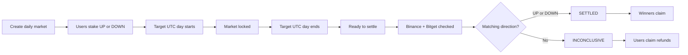
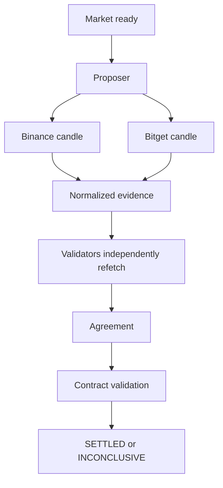

# Baskt

Daily ETF UP/DOWN prediction markets powered by GenLayer.

Baskt lets users predict whether a supported ETF-linked perpetual market will close above or below its opening price for a specific UTC day. Binance Futures and Bitget Futures are used as independent settlement sources.

| Resource | Link |
| --- | --- |
| Live Demo | [Open Baskt](https://baskt-black.vercel.app/) |
| GitHub | [github.com/jason4185/baskt](https://github.com/jason4185/baskt) |
| Deployed contract | [`0x1Dd45ED4eD6f66768deAF6C3c91F8999f6eD7807`](https://explorer-bradbury.genlayer.com/address/0x1Dd45ED4eD6f66768deAF6C3c91F8999f6eD7807) |
| Network | GenLayer Bradbury Testnet |

## Overview

Baskt is an app-specific daily prediction market built on GenLayer. Each market represents one supported asset and one UTC calendar day.

Users choose `UP` or `DOWN` and stake GEN. The question is whether the asset's daily market close is higher or lower than its daily market open. These markets are linked to ETF-related perpetual futures symbols; they do not represent ownership of SPY, QQQ, EWY, or EWJ shares.

For example, a SPY market for a target UTC day asks whether `SPYUSDT` closes above or below its open during that day:

- `close > open` means `UP`.
- `close < open` means `DOWN`.
- `close == open` is `NON_DIRECTIONAL` and cannot produce a normal winner.

## Live App

Try the deployed app at [baskt-black.vercel.app](https://baskt-black.vercel.app/).

The current deployment uses the GenLayer Bradbury Testnet and the contract listed above.

## How Baskt Works

1. A daily market is created for one supported asset and UTC day.
2. Users connect an injected browser wallet.
3. Users choose `UP` or `DOWN`.
4. Users stake between 1 and 10 GEN.
5. When the target UTC day starts, entries automatically close.
6. When that UTC day ends, the market becomes ready to settle.
7. Anyone can trigger settlement.
8. Baskt checks Binance Futures and Bitget Futures independently.
9. GenLayer validators independently verify the settlement evidence.
10. If both sources agree on `UP` or `DOWN`, the market settles to that direction.
11. If valid directional consensus cannot be established, the market becomes `INCONCLUSIVE`.
12. Winners claim a proportional payout, or users reclaim their stake when a refund applies.



## Why Two Settlement Sources?

Baskt uses Binance Futures and Bitget Futures so the result is not based on one external market-data source alone.

The exact prices reported by the exchanges do not need to match. Baskt compares each source's direction for the same target UTC day. Binance and Bitget must both independently report `UP`, or both must independently report `DOWN`. One valid source alone can never settle the market.

## Supported Markets

| ETF reference | Baskt market symbol |
| --- | --- |
| SPY | `SPYUSDT` |
| QQQ | `QQQUSDT` |
| EWY | `EWYUSDT` |
| EWJ | `EWJUSDT` |

Baskt V1 intentionally supports only these four futures-market symbols. Market creation does not accept arbitrary assets, exchanges, source URLs, intervals, or settlement rules.

## Market Lifecycle

| State | Meaning |
| --- | --- |
| `OPEN` | Users can stake. |
| `LOCKED` | The target UTC day has started and new entries are closed. |
| `READY_TO_SETTLE` | The target UTC day has ended and settlement can be triggered. |
| `SETTLED` | Binance and Bitget agreed on `UP` or `DOWN`. |
| `INCONCLUSIVE` | A valid directional agreement was not reached and refunds apply. |

The contract derives these states from deterministic UTC timestamps. No administrator needs to send a separate transaction to close entries. The target window is `[target_start, target_end)`, where `target_start` is midnight UTC on the target day and `target_end` is midnight UTC on the following day.

## Settlement Flow

When a market is ready, Baskt requests the exact daily candle for the target UTC window.

Binance Futures uses:

```text
symbol=<supported_symbol>
interval=1d
startTime=target_start_ms
endTime=target_end_ms - 1
limit=1
```

Bitget Futures uses:

```text
symbol=<supported_symbol>
productType=usdt-futures
granularity=1Dutc
startTime=target_start_ms
endTime=target_end_ms - 1
limit=1
```

For both sources, the response must contain a valid candle whose timestamp is exactly `target_start_ms`. Previous-day, next-day, nearest, missing, malformed, or incorrectly shaped candles are rejected. The candle's open is read from index 1 and its close from index 4.

Each source receives exactly three total fetch attempts. A valid flat candle is accepted as `NON_DIRECTIONAL` without another attempt. After three invalid or unavailable attempts, that source is recorded as `UNAVAILABLE`.

The settlement result is:

| Binance direction | Bitget direction | Result |
| --- | --- | --- |
| `UP` | `UP` | `SETTLED` to `UP` |
| `DOWN` | `DOWN` | `SETTLED` to `DOWN` |
| Any other combination | Any other combination | `INCONCLUSIVE` |

Any combination other than matching `UP`/`UP` or `DOWN`/`DOWN` results in `INCONCLUSIVE` after source evaluation.

## Validator Consensus

Baskt does not simply trust the first machine that fetches Binance and Bitget.

The proposer fetches both sources. Validators independently fetch the same sources and compare normalized settlement evidence, including the material timestamp, prices, directions, status, and attempt count. Irrelevant request metadata is not part of the result. The contract validates the agreed result again before storing the final market outcome.

This follows the same core validator/equivalence design philosophy as Strata while using Baskt's own daily-candle sources and direction rules.

A temporary validator or GenLayer execution failure is different from a source failure. It fails the settlement transaction safely and leaves the market retryable. It does not permanently mark the market `INCONCLUSIVE`.



## Staking and Payouts

| Rule | Value |
| --- | --- |
| Minimum stake | `1 GEN` |
| Maximum cumulative stake | `10 GEN` per wallet per market |
| V1 fees | None |
| Entry deadline | Target day start in UTC |

Users can top up the same side until the market locks. A wallet cannot switch from `UP` to `DOWN`, or from `DOWN` to `UP`, after entering. The 10 GEN limit applies to the wallet's cumulative stake in that market, not to each transaction.

For a normally settled market, the total pool is shared proportionally among users on the winning side:

```text
payout = total pool × user winning stake ÷ total winning-side stake
```

The contract calculates the amount using integer arithmetic. The frontend never supplies a payout amount.

If the market is `INCONCLUSIVE`, users can claim their original stake back. If the settled winning direction has no stake on that side, Baskt also sets `refund_all` and returns every participant's original stake rather than leaving funds stranded. The directional evidence remains stored for auditability.

## Architecture

Baskt has three cooperating layers:

### GenLayer contract

The contract is the canonical source of truth for:

- markets and their lifecycle
- positions and side pools
- settlement and normalized evidence
- payouts, refunds, and claims
- bounded pagination and user reads

### Frontend

The React frontend handles market discovery, wallet connection, transaction submission, market details, portfolio views, activity submitted from the browser, and claim actions.

### Public live market data

The frontend also displays current prices, 24-hour changes, and historical charts for context. This data is display-only.

> Live frontend prices and charts do not determine settlement. Settlement comes only from the GenLayer contract's Binance and Bitget consensus logic.

## Contract Design

Baskt is an app-specific contract rather than a reusable prediction-market framework. Its important design properties are:

- permissionless market creation for the fixed asset and UTC-day allowlist
- permissionless settlement after the target day ends
- caller-bound claims with no caller-supplied payout amount
- fixed Binance Futures and Bitget Futures source configuration
- bounded source responses and exactly three attempts per source
- strict target candle timestamp verification
- bounded mappings, indexes, scans, and pagination
- no `DynArray`
- effects-before-transfer claim ordering
- compact evidence storage with no raw API response blobs
- deployed contract source size below the 52 KB project limit

Deployed contract:

[`0x1Dd45ED4eD6f66768deAF6C3c91F8999f6eD7807`](https://explorer-bradbury.genlayer.com/address/0x1Dd45ED4eD6f66768deAF6C3c91F8999f6eD7807)

## Frontend

The frontend provides:

- Markets and supported-asset discovery
- Market Detail pages with live price context, charts, pools, state, and evidence
- Create Market for supported assets and future UTC days
- Portfolio views for active, claimable, and historical positions
- Browser-submitted Activity records
- How It Works documentation

It uses real contract reads and writes, React Query caching, bounded polling, live ETF-linked prices, 24-hour changes, and responsive Strata-style historical line charts. Contract state controls the market state, pools, positions, capacity, settlement evidence, claimable amounts, and pagination.

## Wallet Support

Baskt uses RainbowKit, wagmi, and viem for wallet interaction. It supports injected browser wallets such as MetaMask, Rabby, and other compatible EIP-1193 wallets. Wallet connection is required for writes and user-specific reads, but public markets and live prices can be viewed without a wallet.

## Project Structure

```text
baskt/
├── contracts/
│   ├── Baskt.py
│   └── README.md
├── tests/
│   ├── direct/
│   └── integration/
├── docs/
│   └── architecture.md
├── frontend/
├── README.md
└── .gitignore
```

## Getting Started

The contract tooling uses Python and the GenLayer development tools. The frontend uses Node.js and npm. The repository includes the development dependency requirements and frontend package scripts; use the versions supported by those project files.

For local contract work:

```bash
python -m venv .venv
source .venv/bin/activate
pip install -r requirements-dev.txt
```

Integration tests also require a configured and running GenLayer localnet, Studio, StudioNet, or another supported endpoint.

## Running Locally

Start the frontend with:

```bash
cd frontend
npm install
npm run dev
```

The development server prints its localhost URL. Configure a compatible injected wallet for the GenLayer Bradbury Testnet before submitting transactions.

## Testing

From the repository root, run the direct contract tests:

```bash
.venv/bin/pytest tests/direct/ -v
```

Run the integration suite when a GenLayer endpoint is available:

```bash
BASKT_RUN_INTEGRATION=1 .venv/bin/gltest tests/integration/ -v -s
```

The contract validation commands are:

```bash
genvm-lint check contracts/Baskt.py
genvm-lint schema contracts/Baskt.py --output baskt-schema.json
genvm-lint typecheck contracts/Baskt.py
```

Run the frontend checks from `frontend/`:

```bash
npm run typecheck
npm run lint
npm run build
```

## Security and Safety

- The contract is the source of truth; the frontend cannot choose settlement results or claim amounts.
- Only the four supported assets and fixed settlement sources are accepted.
- Source responses are bounded, each source has three total attempts, and candle timestamps must exactly match the target UTC start.
- Binance and Bitget must agree on direction before a normal settlement is stored.
- Temporary validator execution failures leave settlement retryable.
- Claims are bound to the caller's own position, protected against double claims, and update state before transfer.
- Stake caps, same-side position rules, pool accounting, and zero-winner refunds are enforced by the contract.
- Pagination and raw scans are bounded, and persistent storage uses no `DynArray`.
- The frontend accepts no arbitrary contract address or RPC configuration from users.
- No private keys, seed phrases, or wallet secrets are stored in the frontend.

## Deployment

Deploy and interact using the GenLayer tooling configured for the project. Validate the contract with GenVM lint and schema extraction before deployment, then verify that the deployed address and network match the frontend configuration.

The current deployment target is the GenLayer Bradbury Testnet. The frontend is configured to use the deployed Baskt contract at `0x1Dd45ED4eD6f66768deAF6C3c91F8999f6eD7807`.

## Current Status

The current repository verification status is:

| Check | Result |
| --- | --- |
| Direct contract tests | 45 passed |
| Integration execution | Requires an available GenLayer endpoint |
| GenVM lint | Passed |
| Schema extraction | Passed |
| Contract typecheck | Passed |
| DynArray | No |
| Contract size | 37,869 bytes |
| 52 KB contract limit | Passed |
| Frontend typecheck | Passed |
| Frontend lint | Passed with non-failing Fast Refresh warnings |
| Frontend build | Passed |

The integration command is intentionally environment-dependent; it must be run against a configured GenLayer execution endpoint.
